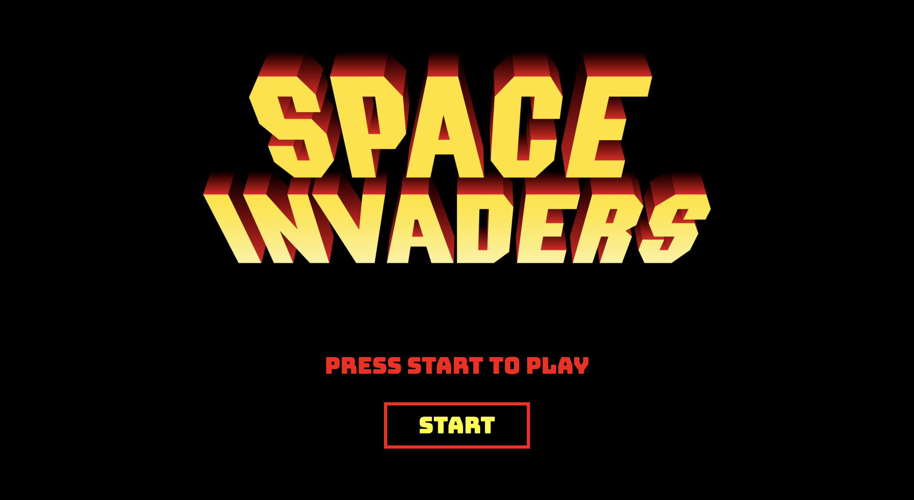
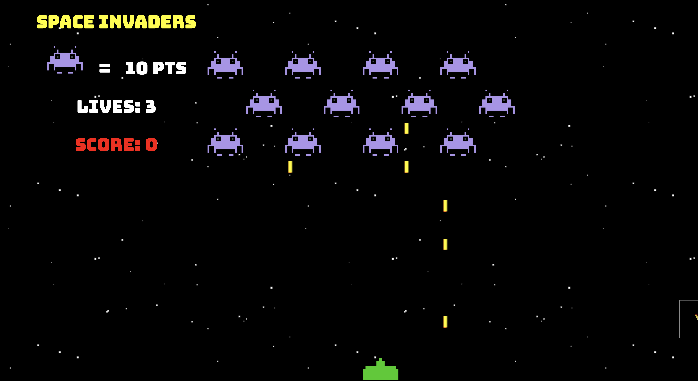
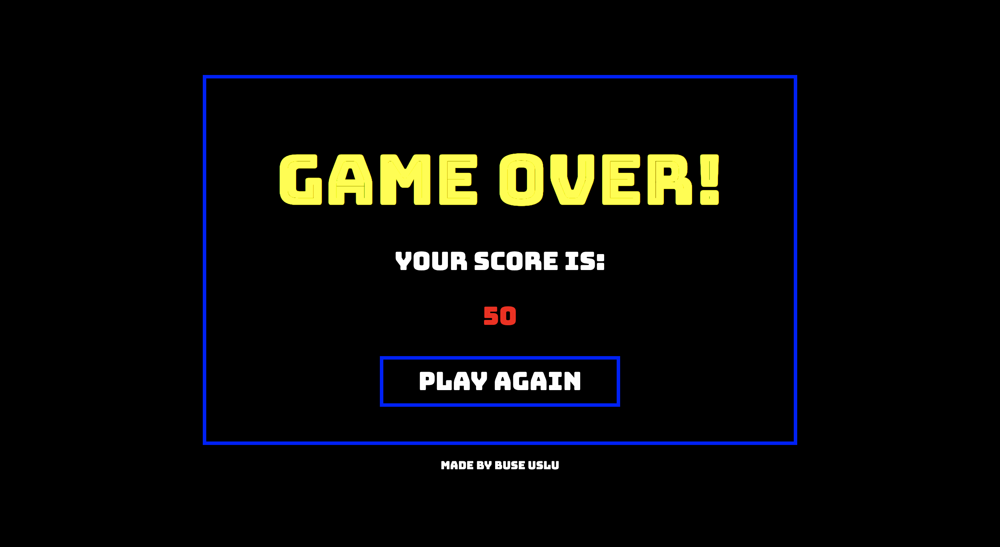
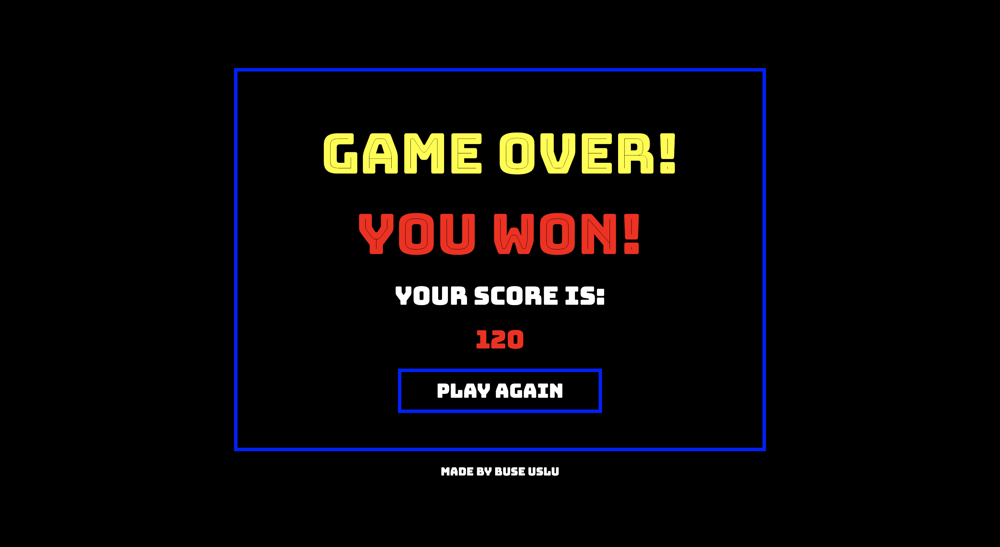

# Space Invaders Game
## WDI Project 1


Project-1

## Goal
To create a fully functional game by using HTML5, CSS and vanilla JavaScript.

## Project Overview
Space Invaders is a classic arcade game from the 80s. The player aims to shoot an invading alien armada, before it reaches the planet's surface using a mounted gun turret.

The player can only move left or right. The aliens also move from left to right, and also down each time the reach the side of the screen. The aliens also periodically drop bombs towards the player.

Once the player has destroyed a wave of aliens, the game starts again. The aim is to achieve the highest score possible before either being destroyed by the aliens, or allowing them to reach the planet's surface.

## Overview
I developed a classic space invaders arcade game in one week. This was a solo project which I worked on alone. The player uses the space and arrow keys to play the game.

## Website
https://buseuslu.github.io/wdi-project-1/

## Timeframe
7 days

## Technologies used
* HTML5
* CSS
* Javascript

## Screenshots
#### Main page
The player needs to click start button to play the game.


#### Game
The player uses the arrow keys to move the ship left and right and the space key to shoot the aliens. Aliens move right, left and down gradually. The player gets 10 points by eliminating an alien. The player has 3 lives. Lives are lost if hit by an alien missile.


### Game-Over
If player loses 3 lives or the aliens reach to the ship the game ends.



### Game-Over-Win
If the player manages to eliminate all the aliens, the player wins the game.



## Process
I created the game by using a grid layout. I created the grid system in Javascript. This made it easier to move the ship, aliens and the missiles in the game. Once I created the grid system, I placed the ship and the aliens on it.

Then, I made ship to shoot the aliens. I finally created another function to make aliens drop missiles randomly. I also added 3 lives for the player which are lost if hit by an alien missile.

I finally added audio.

## Challenges
It was challenging to make aliens move left and right as well as down. After 'game-over' screen, I realised that the game was still running in the background. I fixed that by adding time intervals.

## Wins
* Creating a fully functional game with vanilla Javascript.
* I manage to move the aliens by using this code:
```javascript
let movesMade = 0
function moveAliens() {
  for(let i = 0; i < alien.position.length; i++) {
    if (gameOver) {
      return
    }
    if (alien.position[i] > 79) {
      clearInterval(alienTimer)
      clearInterval(missileTimer)
      clearInterval(alienAttackTimer)
      gameOver = true
      $('#game-over-score').text(score)
      $('.game').hide()
      $('.game-over').css('display', 'flex')
    }
    if (movesMade === 3) {
      squareElement[alien.position[i]].classList.remove('alien')
      alien.position[i] = alien.position[i] + 10
      squareElement[alien.position[i]].classList.add('alien')
    } else if (movesMade === 1) {
      squareElement[alien.position[i]].classList.remove('alien')
      alien.position[i] = alien.position[i] + 10
      squareElement[alien.position[i]].classList.add('alien')
    } else if (movesMade > 1 && movesMade < 4) {
      squareElement[alien.position[i]].classList.remove('alien')
      alien.position[i] = alien.position[i] - 1
      squareElement[alien.position[i]].classList.add('alien')
    } else if(movesMade < 1) {
      squareElement[alien.position[i]].classList.remove('alien')
      alien.position[i] = alien.position[i] + 1
      squareElement[alien.position[i]].classList.add('alien')
    }
  }
  if (movesMade === 3) {
    movesMade = 0
  } else {
    movesMade++
  }
}
```
## Future Features
* Responsive Design
* Each wave gets more difficult
